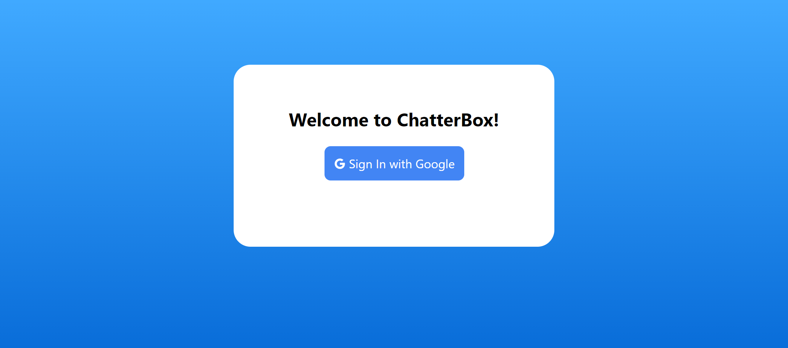
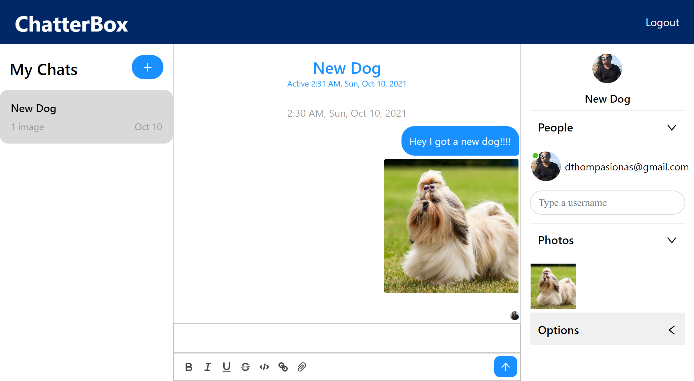

# ChatterBox 

https://github.com/dthompasionas/ChatterBox

Deployed:
https://chatterbox-app.netlify.app/

# Description
This is an instant messenger application using firebase and react-chat-engine.

# Table of Contents
* [License](#license) 
* [Installation](#installation)
* [Tests](#tests)
* [Usage](#usage)
* [Contribute](#contribute)
* [Questions](#questions)

# License 
This project is licensed with a MIT license.

# Installation
The following necessary dependencies are required to run this app: npm install in terminal. This app uses Firebase and React-chat-engine.

# Tests
The following command is needed to run test: npm start

# Usage
In order to use this app, Login with FaceBook is under construction.

# Contribute
contact me below

# Screenshot:

# Questions
Contact me with any questions here:

*Github: dthompasionas

*email: dthompasionas@gmail.com 
